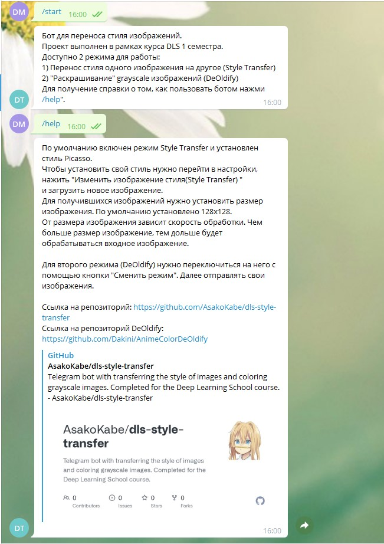
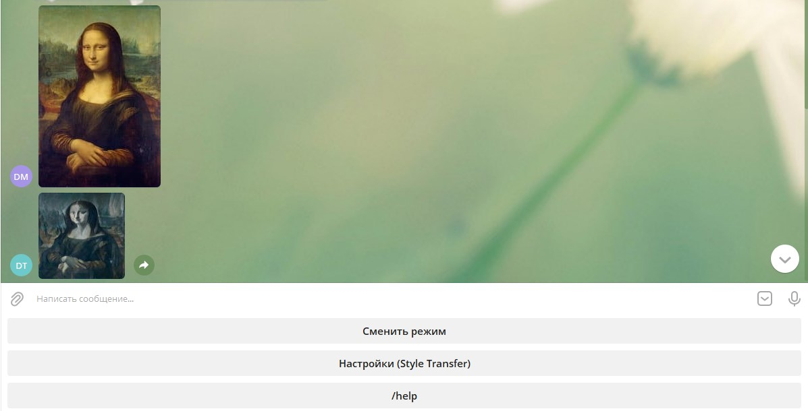
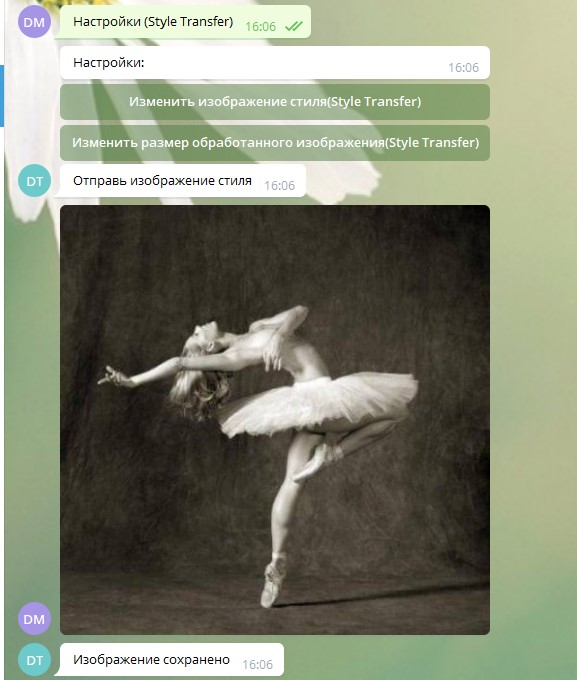
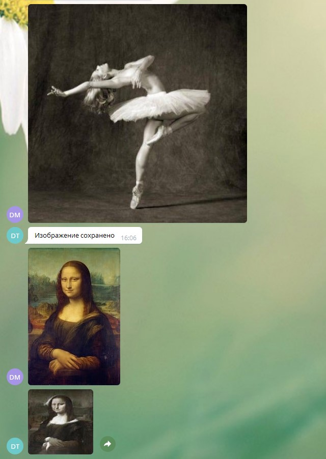
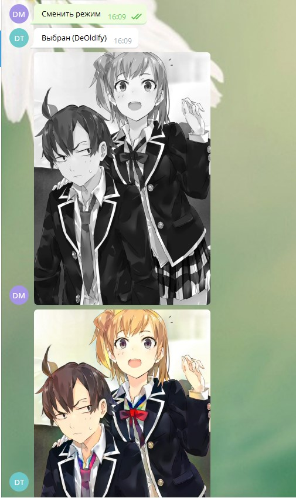

# Telegram bot

@dls_project_style_transfer_bot

Доступные команды:

    /start - начать работу

    /help - краткая сводка о боте

Бот разработан, как проект по курсу DLS 1 семестр от МФТИ.
Реализовано два модуля:
1) Style Transfer из курса
2) DeOldify

DeOldify - https://github.com/Dakini/AnimeColorDeOldify

Для DeOldify нужно скачать веса (https://drive.google.com/drive/folders/1fvotft3Lp6XHdDzmWqFEJ7UaZit5YLs1?usp=sharing)
и положить в папку /src/AnimeColorDeOldify/models/

# Пример работы

